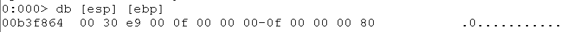

# Info de Reverse sous windows

## La pile
Les stacks frame peuvent ne pas être contigues suivant la randomisation. Voir Windows Internals  
Sous windows, la pile s'étend vers le bas.  
En 64bits, la calling convention est fastcall.Extrait de la doc microsoft: Les arguments entiers sont passés dans les registres RCX, RDX, R8 et R9. Les arguments à virgule flottante sont passés dans XMM0L, XMM1L, XMM2L et XMM3L. Les arguments de plus de 16 octets sont passés par référence.   
Pour 32 bits, la calling convention est cdecl.  
Les paramètres sont passés par la stack dans l'ordre inverse de leur déclaration.  
De manière générale, les retours de fonction se font via EAX.


## demo avec windbg
Pour la démo, compiler avec cl.exe /Zi demo.cpp
/Zi Génère des informations de débogage complètes.
Attention à connaitre si le binaire est 32 ou 64 (avec dumpbin /headers demo.exe par exemple dans la section FILE HEADER VALUES)
Dans mon cas, c'est un 32 bits sur un OS 64bits.
La fonction est
```
void foo(int a, int b) {
    int c = a + b;
    printf("Résultat: %d\n", c);
}
```
### les fenêtres intéressantes
Memory
Registers
Callstack
Disassembly
Command
penser au workspace windbg !!

### Lancement

lm m wow64 liste les modules chargés dont le pattern en wow64
!info pour avoir des informations

x demo!main renvoi la fonction main du module demo
x demo!*main* renvoi les fonctions contenant main du module demo
x demo!* renvoi tous les symboles du module demo

bp demo!main fixe un breakpoint sur le début de la fonction main
g pour executer le binaire jusqu'au prochain breakpoint (il faut parfois le faire 2 fois car windbg pose des bp)

kb pour afficher la callstack (de manière générale k est pour la call stack)

db memoire memoire(optionnel) affiche la zone mémoire découpée en octet avec une représentation ascii

Exemple avec la fonction foo du modules testre (binaire 32 Bits)
Attention c'est du little-endian
avant le lancement de la fonction 
EIP e27220
ESP b3f884
EBP b3f8c8

La stack frame avant le jmp est 


Après le jmp vers foo
EIP e271f0 
ESP b3f880
EBP b3f880

La fonction est désasemblée comme suit

On voit que les 2 paramètres sont récupérés de la pile, l'opération est faite, stocké sur la pile avant l'appel à printf etc....  
et voici la pile avant l'épilogue de la fonction


.restart pour redémarrer une session de débug
 

